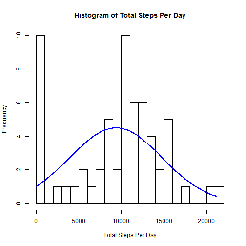
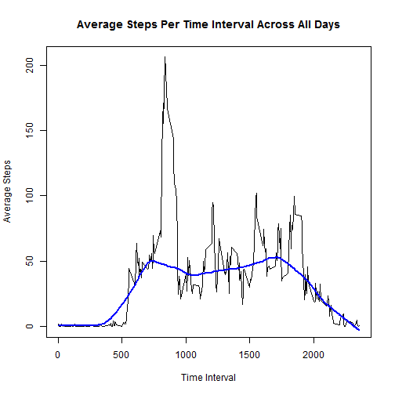
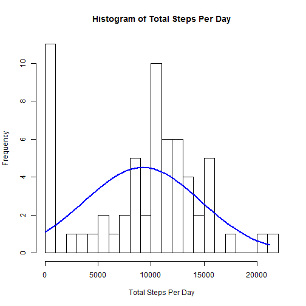
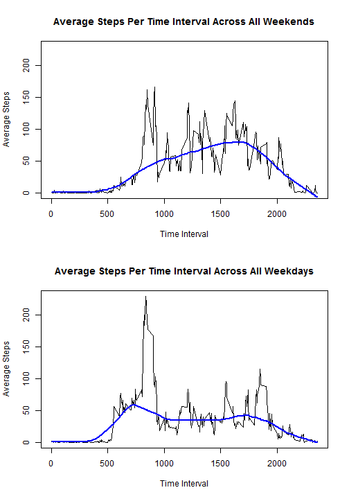

- This version by Adam Moses
- Forked from the original rdpeng github repository
- Assignment due date is 2016-01-10

## Loading and preprocessing the data

Make sure to unzip activity.zip file containing the .csv file with the data:

```r
     unzip("activity.zip")
```

Load the data using the custom comma-seperated-value loader:

```r
     originalData <- read.csv("activity.csv")
```

And here's a summary of what was loaded:

```r
     summary(originalData)
```

```
##      steps                date          interval     
##  Min.   :  0.00   2012-10-01:  288   Min.   :   0.0  
##  1st Qu.:  0.00   2012-10-02:  288   1st Qu.: 588.8  
##  Median :  0.00   2012-10-03:  288   Median :1177.5  
##  Mean   : 37.38   2012-10-04:  288   Mean   :1177.5  
##  3rd Qu.: 12.00   2012-10-05:  288   3rd Qu.:1766.2  
##  Max.   :806.00   2012-10-06:  288   Max.   :2355.0  
##  NA's   :2304     (Other)   :15840
```

And a quick peek at the head of the data:

```r
     head(originalData)
```

```
##   steps       date interval
## 1    NA 2012-10-01        0
## 2    NA 2012-10-01        5
## 3    NA 2012-10-01       10
## 4    NA 2012-10-01       15
## 5    NA 2012-10-01       20
## 6    NA 2012-10-01       25
```


## What is mean total number of steps taken per day?

First remove all entries with NA values:

```r
     # omit all rows with an NA
     goodData <- na.omit(originalData)
```

Get a vector of all the unique dates, note that dates are the second column:

```r
     # get this from the originalData to make sure no dates are missed
     individualDates <- unique(originalData[,2])
```

For each date, create a vector of just the steps, record the total and add it to a vector tracking the totals for all the dates.

```r
     # create an empty vector to track totals
     totalStepsEachDay <- c()
     
     # iterate through the dates
     for (curDate in individualDates)
     {
          # create a subset for the current date
          # isolate just the steps
          # and record the total, aka the sum
          curDateStepsTotal <- sum(subset(goodData, date == curDate)[,1])
          # add this value to the totals track vector
          totalStepsEachDay <- c(totalStepsEachDay, curDateStepsTotal)
     }
```

Taking a peak at that vector:

```r
     head(totalStepsEachDay)
```

```
## [1]     0   126 11352 12116 13294 15420
```

And render a histogram showing it:

```r
     # histogram with 25 cell breaks across
     histA <- hist(totalStepsEachDay, 
          breaks = 25,
          main = "Histogram of Total Steps Per Day",
          xlab = "Total Steps Per Day")
     # draw a fit line through it as well
     xfit <- seq(min(totalStepsEachDay), 
                 max(totalStepsEachDay), 
                 length = 40)
     yfit <- dnorm(xfit, 
                   mean = mean(totalStepsEachDay), 
                   sd = sd(totalStepsEachDay))
     yfit <- yfit * diff(histA$mids[1:2]) * length(totalStepsEachDay)
     lines(xfit, yfit, col = "blue", lwd = 2) 
```

 

Now that we have a vector with the total for each of the dates, compute the mean and median, print them:

```r
     # compute the mean median
     avgTotalStepsEachDay <- mean(totalStepsEachDay)
     medTotalStepsEachDay <- median(totalStepsEachDay)
     print(c(avgTotalStepsEachDay, medTotalStepsEachDay))
```

```
## [1]  9354.23 10395.00
```

Therefore we can say that:

- The mean total number of steps taken per day is <b>9354.23</b>.
- The median total number of steps taken per day is <b>10395</b>.


## What is the average daily activity pattern?

Get a vector of all the unique time intervals, note time intervals are third column:

```r
     # get this from orignalData set just to make sure all time intervals are found
     individualTimeIntervals <- unique(originalData[,3])
```

For each time interval, create a vector of just the steps, record the mean and add it to a vector tracking the mean for all the time intervals.

```r
     # create an empty vector to track means
     avgStepsEachTimeInterval <- c()
     
     # iterate through the time intervals
     for (curTimeInterval in individualTimeIntervals)
     {
          # create a subset for the current time interval
          # isolate just the steps
          # and record the mean
          curTimeIntervalStepsAvg <- mean(subset(goodData, interval == curTimeInterval)[,1])
          # add this value to the means track vector
          avgStepsEachTimeInterval <- c(avgStepsEachTimeInterval, curTimeIntervalStepsAvg)
     }
```

Taking a peak at that vector:

```r
     print(head(avgStepsEachTimeInterval))
```

```
## [1] 1.7169811 0.3396226 0.1320755 0.1509434 0.0754717 2.0943396
```

Plot the data we just gathered:

```r
     # plot the data
     plot(individualTimeIntervals,
          avgStepsEachTimeInterval,
          type = "l",
          main = "Average Steps Per Time Interval Across All Days",
          xlab = "Time Interval",
          ylab = "Average Steps")
     # draw a fit line
     lines(lowess(individualTimeIntervals,
                  avgStepsEachTimeInterval, 
                  f = 1/4), 
           col="blue", 
           lwd = 2)
```

 

Using the vector with the averages of steps per time interval across all days, determine which time interval has the maximum number of average steps:

```r
     # find the max value, it's position, and the corresponding time interval
     maxAvgStepsValue        <- max(avgStepsEachTimeInterval)
     maxAvgStepsPosition     <- which.max(avgStepsEachTimeInterval)
     maxAvgStepsTimeInterval <- individualTimeIntervals[maxAvgStepsPosition]
     # print these variables
     print(c(maxAvgStepsValue, maxAvgStepsPosition, maxAvgStepsTimeInterval))
```

```
## [1] 206.1698 104.0000 835.0000
```

Therefore we can say the time interval with the maximum number of average steps across all days is <b>835</b> which has the value of <b>206.1698</b> average steps.


## Imputing missing values

Using the original data again, count the number of rows with NA data:

```r
     # get the sum of NA's in the originalData
     totalNAValues <- sum(is.na(originalData[,1]))
     print(totalNAValues)
```

```
## [1] 2304
```

So there are <b>2304</b> bad rows in the original data set's <b>17568</b> total number of rows.

Create a copy of the original data that will be fixed:

```r
     fixedData <- originalData
```

Iterate through all the rows, if the steps variable is an NA value replace it with the average number of steps across all days for that time interval which we computed in the last section:

```r
     # for each row in the data set
     for (index in 1:(dim(fixedData)[1]))
     {
          # if the steps value is NA
          if (is.na(fixedData[index,1]))
          {
               # determine the position in the average steps vector matchin the time interval
               indexTimeIntervalPosition <- match(fixedData[index,3], individualTimeIntervals)
               # get the replacement step value based on the position
               replacementValue <- avgStepsEachTimeInterval[indexTimeIntervalPosition]
               # replace the step value in the fixed data set with this value
               fixedData[index,1] <- replacementValue
          }
     }
```

And here's a summary of what the fixed data looks like:

```r
     summary(fixedData)
```

```
##      steps                date          interval     
##  Min.   :  0.00   2012-10-01:  288   Min.   :   0.0  
##  1st Qu.:  0.00   2012-10-02:  288   1st Qu.: 588.8  
##  Median :  0.00   2012-10-03:  288   Median :1177.5  
##  Mean   : 37.38   2012-10-04:  288   Mean   :1177.5  
##  3rd Qu.: 27.00   2012-10-05:  288   3rd Qu.:1766.2  
##  Max.   :806.00   2012-10-06:  288   Max.   :2355.0  
##                   (Other)   :15840
```

And a quick peek at the head of the fixed data:

```r
     head(fixedData)
```

```
##       steps       date interval
## 1 1.7169811 2012-10-01        0
## 2 0.3396226 2012-10-01        5
## 3 0.1320755 2012-10-01       10
## 4 0.1509434 2012-10-01       15
## 5 0.0754717 2012-10-01       20
## 6 2.0943396 2012-10-01       25
```

As was done for the earlier calculations, for each date, create a vector of just the steps, record the total and add it to a vector tracking the totals for all the dates:

```r
     # create an empty vector to track totals
     totalStepsEachDayFixed <- c()
     
     # iterate through the dates
     for (curDate in individualDates)
     {
          # create a subset for the current date
          # isolate just the steps
          # and record the total, aka the sum
          curDateStepsTotalFixed <- sum(subset(fixedData, date == curDate)[,1])
          # add this value to the totals track vector
          totalStepsEachDayFixed <- c(totalStepsEachDay, curDateStepsTotal)
     }
```

Taking a peak at that new "fixed" vector:

```r
     head(totalStepsEachDayFixed)
```

```
## [1]     0   126 11352 12116 13294 15420
```

And render a histogram showing it:

```r
     # histogram with 25 cell breaks across
     histA <- hist(totalStepsEachDayFixed, 
          breaks = 25,
          main = "Histogram of Total Steps Per Day",
          xlab = "Total Steps Per Day")
     # draw a fit line through it as well
     xfit <- seq(min(totalStepsEachDayFixed), 
                 max(totalStepsEachDayFixed), 
                 length = 40)
     yfit <- dnorm(xfit, 
                   mean = mean(totalStepsEachDayFixed), 
                   sd = sd(totalStepsEachDayFixed))
     yfit <- yfit * diff(histA$mids[1:2]) * length(totalStepsEachDayFixed)
     lines(xfit, yfit, col = "blue", lwd = 2)      
```

 

Now that we have a vector with the total for each of the dates, compute the mean and median, print them:

```r
     # compute the mean median
     avgTotalStepsEachDayFixed <- mean(totalStepsEachDayFixed)
     medTotalStepsEachDayFixed <- median(totalStepsEachDayFixed)
     print(c(avgTotalStepsEachDayFixed, medTotalStepsEachDayFixed))
```

```
## [1]  9203.355 10349.500
```

Therefore we can say that, for this new fixed data set with the NA values imputed:

- The mean total number of steps taken per day is <b>9203.355</b>, this is compared to the earlier calculation of <b>9354.23</b> which simply ignored them. The mean went up as the computed averages being included raised the totals for every single day by some non-zero rate.
- The median total number of steps taken per day is <b>10349.5</b>, , this is compared to the earlier calculation of <b>10395</b> which simply ignored them. The median changed slightly simply from the new computed value inclusions being used at a higher rate than the other previous median, and therefore changing it slightly.


## Are there differences in activity patterns between weekdays and weekends?

Iterate through all the rows, determine if the date is a weekend or not, and add a factor variable declaring as much to a new vector. Afterwords append this vector as a new variable to dataset.

```r
     # make a copy of the fixed data to use here
     newData <- fixedData
     # create an empty vector to track the weekday/weekend values
     weekdayTrack <- c()
     # for each row in the data set
     for (index in 1:(dim(newData)[1]))
     {
          dayName <- weekdays(as.Date(newData[index,2]))
          weekdayValue <- "weekday"
          if ((dayName == "Saturday") | (dayName == "Sunday"))
               weekdayValue <- "weekend"
          weekdayTrack <- c(weekdayTrack, weekdayValue)
     }
     # turn the vector into a factor
     weekdayTrack <- factor(weekdayTrack)
     # add this vector as a new variable
     newData[,4] <- weekdayTrack
     # rename that column
     names(newData)[4] <- "daytype"
```

Take a look at how the new data set is summarized:

```r
     summary(newData)
```

```
##      steps                date          interval         daytype     
##  Min.   :  0.00   2012-10-01:  288   Min.   :   0.0   weekday:12960  
##  1st Qu.:  0.00   2012-10-02:  288   1st Qu.: 588.8   weekend: 4608  
##  Median :  0.00   2012-10-03:  288   Median :1177.5                  
##  Mean   : 37.38   2012-10-04:  288   Mean   :1177.5                  
##  3rd Qu.: 27.00   2012-10-05:  288   3rd Qu.:1766.2                  
##  Max.   :806.00   2012-10-06:  288   Max.   :2355.0                  
##                   (Other)   :15840
```

Compute the average steps per time interval across all days, tracking for weekend or weekday, this code is basically the same as the earlier version only split for the two day types:

```r
     # create an empty vector to track means
     avgStepsEachTimeIntervalWeekend <- c()
     avgStepsEachTimeIntervalWeekday <- c()
     
     # iterate through the time intervals
     for (curTimeInterval in individualTimeIntervals)
     {
          # create a subset for the current time interval
          # isolate just the steps
          # and record the mean
          # do this for both day types
          curTimeIntervalStepsAvgWeekend <- mean(subset(newData, interval == curTimeInterval
                                                            & daytype == "weekend")[,1])
          curTimeIntervalStepsAvgWeekday <- mean(subset(newData, interval == curTimeInterval
                                                            & daytype == "weekday")[,1])
          # add this value to the means track vector for both types
          avgStepsEachTimeIntervalWeekend <- c(avgStepsEachTimeIntervalWeekend, 
                                               curTimeIntervalStepsAvgWeekend)
          avgStepsEachTimeIntervalWeekday <- c(avgStepsEachTimeIntervalWeekday,
                                               curTimeIntervalStepsAvgWeekday)
     }
```

So we can look at the summaries:

```r
     dataSummaries <- data.frame(Weekends = 
                                      avgStepsEachTimeIntervalWeekend,
                                 Weekdays =
                                      avgStepsEachTimeIntervalWeekday)
     print(summary(dataSummaries))
```

```
##     Weekends          Weekdays      
##  Min.   :  0.000   Min.   :  0.000  
##  1st Qu.:  1.241   1st Qu.:  2.247  
##  Median : 32.340   Median : 25.803  
##  Mean   : 42.366   Mean   : 35.611  
##  3rd Qu.: 74.654   3rd Qu.: 50.854  
##  Max.   :166.639   Max.   :230.378
```

Create time-series plots, one for weekends and one for weekdays, using the same y-axis range to show scale:

```r
     # setup for two plots
     par(mfrow = c(2, 1))
     # get a proper range for the y-Axis to compare data equally
     yLimLower <- min(avgStepsEachTimeIntervalWeekend,
                      avgStepsEachTimeIntervalWeekday)
     yLimUpper <- max(avgStepsEachTimeIntervalWeekend,
                      avgStepsEachTimeIntervalWeekday)
     yLimSpread <- range(yLimLower:yLimUpper)
     # plot for weekends
     plot(individualTimeIntervals,
          avgStepsEachTimeIntervalWeekend,
          type = "l",
          main = "Average Steps Per Time Interval Across All Weekends",
          xlab = "Time Interval",
          ylab = "Average Steps",
          ylim = yLimSpread)
     # draw a fit line
     lines(lowess(individualTimeIntervals,
                  avgStepsEachTimeIntervalWeekend, 
                  f = 1/4), 
           col="blue", 
           lwd = 2)     
     # plot for weekdays
     plot(individualTimeIntervals,
          avgStepsEachTimeIntervalWeekday,
          type = "l",
          main = "Average Steps Per Time Interval Across All Weekdays",
          xlab = "Time Interval",
          ylab = "Average Steps",
          ylim = yLimSpread)
     # draw a fit line
     lines(lowess(individualTimeIntervals,
                  avgStepsEachTimeIntervalWeekday, 
                  f = 1/4), 
           col="blue", 
           lwd = 2)               
```

 

So from this we can conclude that:

- More steps are consistently taken  on the weekends as opposed to weekdays, however the maximum spike for steps taken easily favors the weekdays. 
- Also, on weekdays activity is highest in the morning and trails off the rest of the day, while on the weekends activity steadily increases until the late afternoon/early evening.

## Hope you enjoyed this!

- This version by Adam Moses
- Forked from the original rdpeng github repository
- Assignment due date is 2016-01-10
